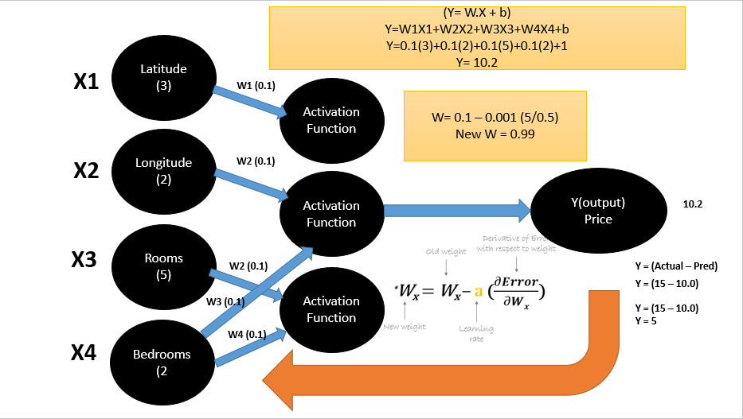

# 🏠 House Price Prediction Using Deep Learning (ANN)

<div align="center">


**A Deep Learning-powered house price prediction system built with an Artificial Neural Network (ANN), served via a Flask web application and Streamlit UI.**

[🚀 Run Locally](#-installation) · [🧠 Model Architecture](#-neural-network-architecture) · [📊 Features](#-features) · [🐛 Report Bug](https://github.com/sohail189/house-price-prediction/issues)

</div>

---

## 📝 Description

The **House Price Prediction System** uses a deep **Artificial Neural Network (ANN)** built with Keras to predict house prices based on geographic and property features from the California Housing dataset.

The project covers the complete ML pipeline — from **data preprocessing** and **model training** to **evaluation** and **deployment** via both a **Flask web app** and a **Streamlit interface**.

> 💡 **Real-World Use Case:** Real estate agents, buyers, and investors can use this tool to instantly estimate property values based on location, house age, room count, and other key factors.

---

## ✨ Features

- 🧠 **Deep ANN Model** — 4-layer neural network with 1000→500→250→1 architecture
- 🔢 **Min-Max Scaling** — Features normalised for optimal neural network performance
- 🌐 **Flask Web App** — User-friendly web interface for real-time predictions
- 📱 **Streamlit App** — Interactive Python-based UI (`app.py`)
- 📉 **Early Stopping** — Prevents overfitting with patience of 50 epochs
- 📊 **Full Model Evaluation** — MAE, MSE, MSLE, and R² score metrics
- 🗺️ **Geographic Features** — Uses longitude/latitude for location-based pricing
- 💾 **Saved Scalers** — Pre-fitted `scaler.pkl` and `min_max_scaler.pkl` for consistent inference
- 📸 **ANN Architecture Diagram** — Visual diagram of the network included

---

## 🧠 Neural Network Architecture

```
Input Layer  →  1000 neurons  (ReLU)
                    ↓
             Dropout (20%)
                    ↓
Hidden Layer 1 → 500 neurons  (ReLU)
                    ↓
             Dropout (20%)
                    ↓
Hidden Layer 2 → 250 neurons  (ReLU)
                    ↓
Output Layer →   1 neuron     (Linear)  ← Predicted House Price
```



| Layer | Neurons | Activation | Regularisation |
|---|---|---|---|
| Input Layer | 1000 | ReLU | — |
| Dropout 1 | — | — | 20% dropout |
| Hidden Layer 1 | 500 | ReLU | — |
| Dropout 2 | — | — | 20% dropout |
| Hidden Layer 2 | 250 | ReLU | — |
| Output Layer | 1 | Linear | — |

**Training Configuration:**

| Parameter | Value |
|---|---|
| Optimizer | RMSprop |
| Loss Function | Mean Squared Error (MSE) |
| Epochs | 10 (with Early Stopping patience=50) |
| Batch Size | 50 |
| Validation Split | 20% |

---

## 🗂️ Dataset

**File:** `housing.csv` — California Housing Dataset

| Feature | Description |
|---|---|
| `longitude` | Geographic longitude of the block |
| `latitude` | Geographic latitude of the block |
| `housing_median_age` | Median age of houses in the block |
| `total_rooms` | Total number of rooms in the block |
| `total_bedrooms` | Total number of bedrooms |
| `population` | Block population |
| `households` | Number of households |
| `median_income` | Median income of households (in $10,000s) |
| `median_house_value` | **Target** — Median house value (in USD) |
| `ocean_proximity` | Location relative to ocean |

---

## 📁 Repository Structure

```
house-price-prediction/
│
├── app.py                  ← Streamlit web application
├── housing.csv             ← California Housing dataset
│
├── 🤖 Saved Models & Scalers
│   ├── scaler.pkl          ← StandardScaler for feature preprocessing
│   └── min_max_scaler.pkl  ← MinMaxScaler for neural network input
│
├── ann_img.PNG             ← ANN architecture diagram
└── README.md               ← Project documentation
```

---

## 📊 Model Evaluation Metrics

| Metric | Description | Goal |
|---|---|---|
| **MAE** (Mean Absolute Error) | Average absolute difference between predicted and actual prices | Lower is better |
| **MSE** (Mean Squared Error) | Average squared difference — penalises large errors | Lower is better |
| **MSLE** (Mean Squared Log Error) | Log-scale error — good for skewed price distributions | Lower is better |
| **R² Score** | Proportion of variance explained by the model | Closer to 1.0 is better |

---

## 📦 Installation

### Step 1 — Clone the Repository

```bash
git clone https://github.com/sohail189/house-price-prediction.git
cd house-price-prediction
```

### Step 2 — Create Virtual Environment

```bash
# Anaconda (recommended)
conda create -n house-price python=3.12
conda activate house-price

# Or standard venv
python -m venv venv
venv\Scripts\activate        # Windows
source venv/bin/activate     # Mac/Linux
```

### Step 3 — Install Dependencies

```bash
pip install streamlit tensorflow scikit-learn pandas numpy flask matplotlib seaborn
```

Or create a `requirements.txt` and install:

```txt
streamlit
tensorflow
keras
scikit-learn
pandas
numpy
flask
matplotlib
seaborn
joblib
```

```bash
pip install -r requirements.txt
```

---

## 🚀 Usage

### Option 1 — Run Streamlit App

```bash
streamlit run app.py
```

Opens at **http://localhost:8501**

### Option 2 — Run Flask Web App

```bash
python app.py
```

Opens at **http://localhost:5000**

### Option 3 — Use the Model in Python

```python
import pickle
import numpy as np

# Load the saved scaler
with open('scaler.pkl', 'rb') as f:
    scaler = pickle.load(f)

# Example input: [longitude, latitude, housing_age, total_rooms,
#                 total_bedrooms, population, households, median_income]
sample = np.array([[-122.23, 37.88, 41.0, 880.0, 129.0, 322.0, 126.0, 8.3252]])

# Scale the input
sample_scaled = scaler.transform(sample)

# Load and use your trained model
from tensorflow import keras
model = keras.models.load_model('house_price_model.h5')
predicted_price = model.predict(sample_scaled)
print(f'Predicted House Price: ${predicted_price[0][0]:,.2f}')
```

---

## 🖥️ Demo

> 💡 *Add screenshots of your app here*

```markdown


```

---

## 🔧 Troubleshooting

| Problem | Solution |
|---|---|
| `ModuleNotFoundError: tensorflow` | Run `pip install tensorflow` |
| `FileNotFoundError: scaler.pkl` | Make sure all `.pkl` files are in the same folder as `app.py` |
| `streamlit: command not found` | Run `pip install streamlit` |
| `App not opening in browser` | Go to `http://localhost:8501` manually |
| Model prediction is very off | Ensure you scale input with the **same** `scaler.pkl` used during training |

---

## 🤝 Contributing

Contributions are welcome!

1. **Fork** the repository
2. **Create** a new branch:
   ```bash
   git checkout -b feature/your-feature-name
   ```
3. **Commit** your changes:
   ```bash
   git commit -m "Add: description of your change"
   ```
4. **Push** and open a **Pull Request**

### 💡 Ideas for Contribution

- [ ] Add more input features (garage, pool, neighbourhood type)
- [ ] Try XGBoost / LightGBM and compare with ANN
- [ ] Add SHAP values for model explainability
- [ ] Deploy to Streamlit Community Cloud or Heroku
- [ ] Add interactive map showing predicted prices by location
- [ ] Add training loss/accuracy curve visualisations in the app
- [ ] Add cross-validation and hyperparameter tuning notebook

---

## 📄 License

This project is licensed under the **MIT License** — free to use, modify, and distribute with attribution.

---

## 📬 Contact

**Muhammad Sohail**
*Data Scientist | Deep Learning Engineer | ML Developer*

[](https://github.com/sohail189)
[](mailto:sm7933294@gmail.com)

🔗 **Project Link:** [https://github.com/sohail189/house-price-prediction](https://github.com/sohail189/house-price-prediction)

---

<div align="center">

Built with ❤️ using Deep Learning & Python

⭐ **Found this useful? Give it a star!** ⭐

</div>
